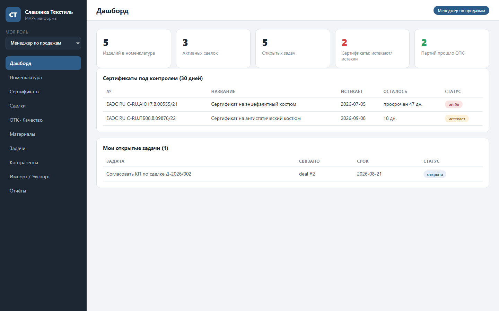
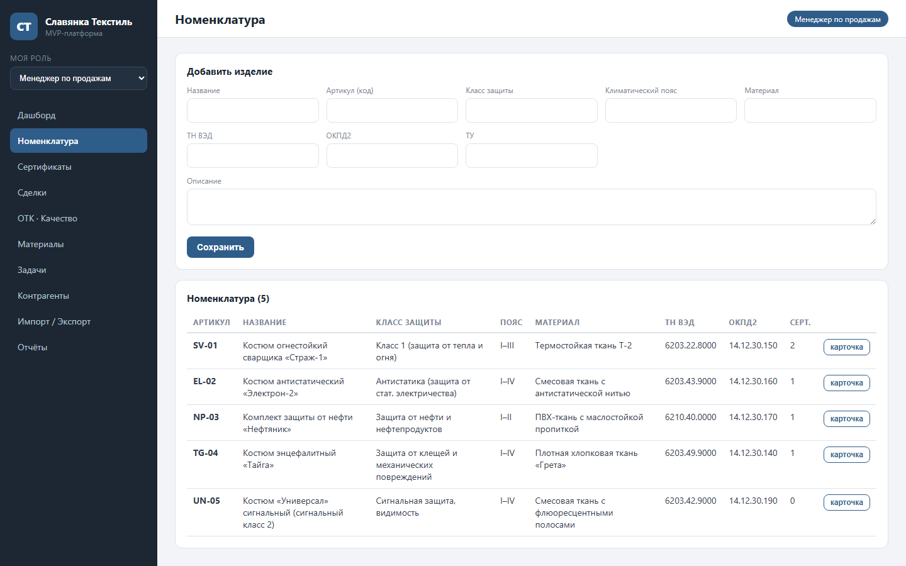
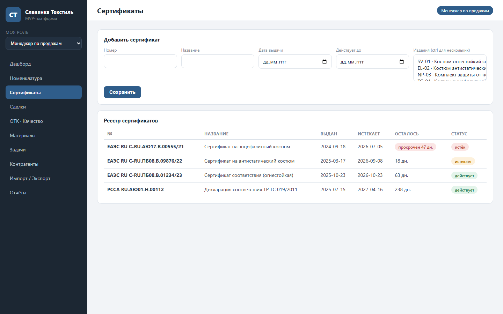
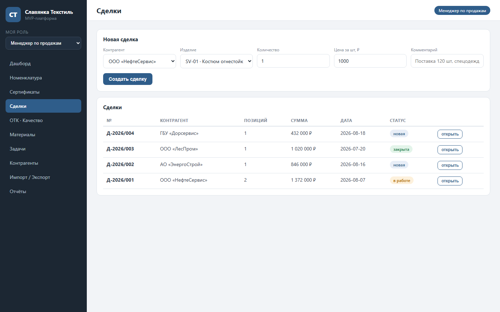

# MVP SaaS-платформа ООО «Славянка Текстиль»

MVP по ТЗ: управление номенклатурой, сертификацией и сделками для производителя
спецодежды (огнестойкая, антистатическая, защита от нефти, энцефалитная одежда).

## Проблема

Производитель спецодежды ведёт номенклатуру, сертификаты и сделки в разрозненных
таблицах и бумажных журналах: сроки действия сертификатов отслеживаются вручную,
данные дублируются, отчёты для руководителя собираются часами.

## Скриншоты

| Дашборд | Номенклатура |
|---|---|
|  |  |

| Сертификаты | Сделки |
|---|---|
|  |  |

## Пользователи

- **Менеджер по продажам** — каталог, коммерческие предложения, сделки
- **Технолог** — номенклатура, материалы, ТУ
- **ОТК** — контроль качества партий, учёт брака
- **Снабженец** — контрагенты и закупки
- **Руководитель** — отчёты и уведомления о критичных событиях

## Возможности (по ТЗ)
- Каталог номенклатуры: класс защиты, климатический пояс, материал, коды ТН ВЭД / ОКПД2, ТУ
- Реестр сертификатов с контролем сроков (30 дней → предупреждения)
- Реестр российской промышленной продукции Минпромторга РФ: записи по изделиям, статусы включения, контроль сроков действия с предупреждением за 8 месяцев
- Сделки и контрагенты, статусы этапов, позиции и суммы
- Документы из шаблонов: КП, договор, акт (генерируются из данных сделки)
- ОТК: задачи проверки партий, статусы, учёт брака
- Задачи по ролям: менеджер по продажам, технолог, ОТК, снабженец
- Импорт/экспорт CSV, XLSX, JSON
- Отчёты: продажи, качество, сертификаты
- Уведомления в Telegram (опционально) + лог в консоли

## Стек
- Node.js (>=22) + Express
- SQLite через встроенный `node:sqlite` (без внешней БД)
- SheetJS (`xlsx`) для CSV/XLSX
- Фронтенд: чистый HTML/CSS/JS, без сборщиков

## Запуск

```bash
npm install
npm start
```

Откройте http://localhost:4000

## Telegram-уведомления (опционально)
Скопируйте `.env.example` в `.env` и заполните:
- `TELEGRAM_BOT_TOKEN` — от @BotFather
- `TELEGRAM_CHAT_ID` — от @userinfobot

Без токена уведомления пишутся в консоль.

## Проверка API
```bash
curl http://localhost:4000/api/products
curl http://localhost:4000/api/certificates
curl http://localhost:4000/api/minpromtorg
curl -X POST http://localhost:4000/api/deals -H "Content-Type: application/json" -d "{\"contractor_id\":1,\"comment\":\"тест\",\"items\":[{\"product_id\":1,\"qty\":10,\"price\":8900}]}"
curl "http://localhost:4000/api/export/products?format=csv"
```